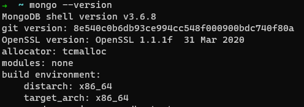
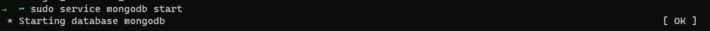
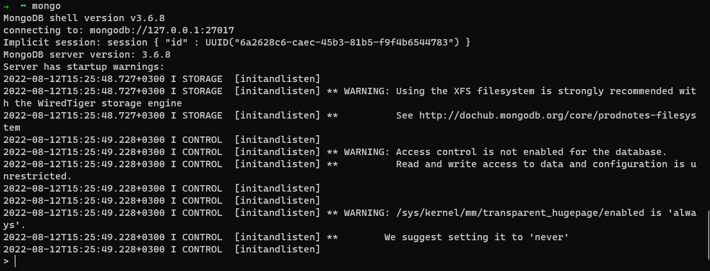
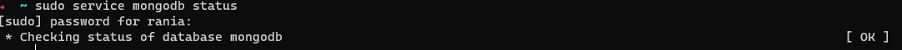

# Mongo-DB-Installation-Guide
## install MongoDB in WSL:
1. Update your Ubuntu packages : 
   ```sudo apt-get update```
2. .Install MongoDB packages :

    ```sudo apt-get install mongodb```
3. Confirm installation and get the version number :   
    ```mongo --version```
   - expected output: 
     
4. Run the server:
     ```sudo service mongodb start ```    
     - expected output: 
     
5. Start mongo console:
    ```mongo```
    - expected output: 
     
6. Check the service status:
   ```sudo service mongodb status```
     - expected output: 
     
   
  


     


  

   


